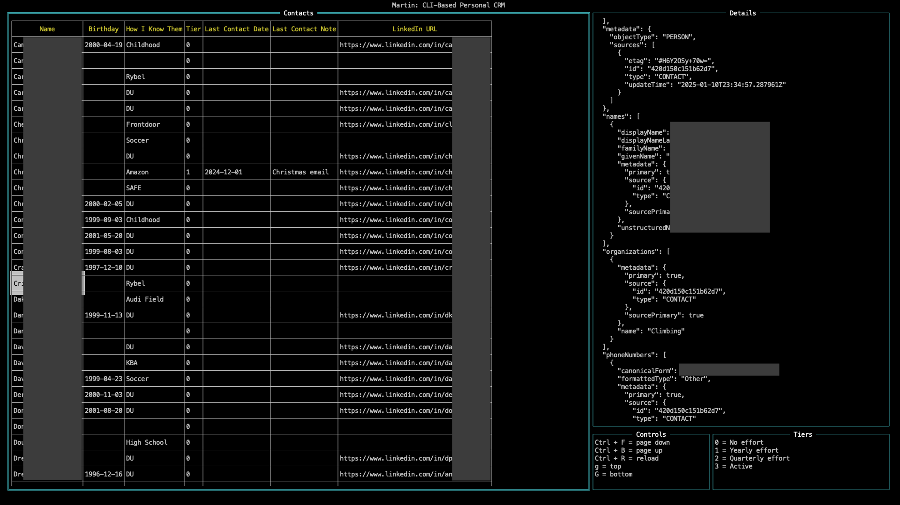

# Martin CRM

Tired of managing your contacts via the horrible Google Contacts website?

Want to keep track of when you last caught up with somebody? (*cough* like a CRM *cough*)

Use the Martin Personal CRM *(a play on [Monica Personal CRM](https://www.monicahq.com))* in your terminal!

## Getting Started
1. Follow the instructions from Google to get a `credentials.json` file - [https://developers.google.com/people/quickstart/go](https://developers.google.com/people/quickstart/go)
2. Run the app `go run .`
3. Authentiate with your Google Account
  - You may need to extract the authorization code from the callback URL manually to paste into the terminal
4. Start updating your contacts & seeing who you are falling out of touch with

